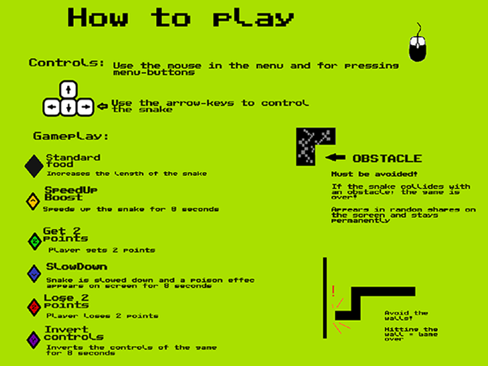

# Snake Evolution

## Introduction
Snake Evolution is a classic Snake game with a familiar design, 
but with a few re-vitalizing twists that "evolve" the well known classic.

## Installation
### Prerequisites
To play Snake Evolution, you need to have Java installed (Java 8 recommended).
Additionally, if you want to build the game yourself, you will need Maven (https://maven.apache.org/download.cgi).

### Download Compiled Game
1. Navigate to Releases and Open the latest release (https://git.chalmers.se/orlovs/gr10-snake-evolution/-/releases)
2. Download the Release archive (v1.x.zip)
3. Unpack the archive
4. Launch the game from the terminal: `java -jar snake-evolution.jar`

### Build
Follow these instructions if you want to build the game locally:
1. Clone the repository or download source code
2. From the project folder `gr10-snake-evolution`, run `mvn clean package`
3. The compiled .jar will appear in the `target` directory.
_Note: the directory that contains the game executable must also contain the assets folder to run!_

## How to Play
