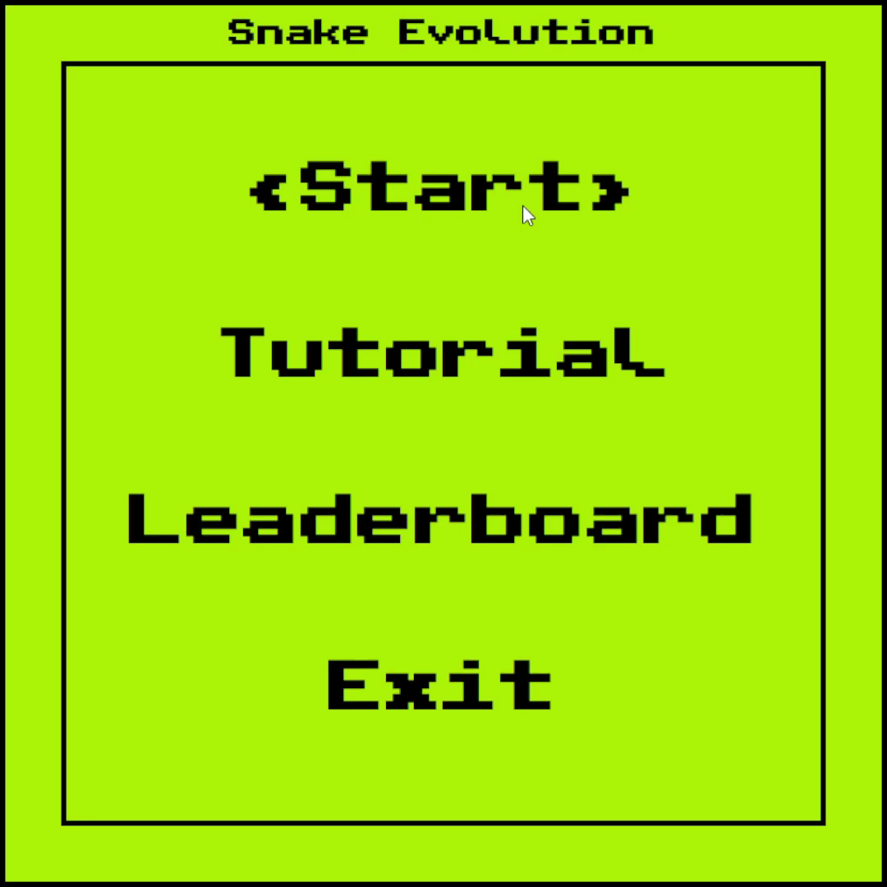
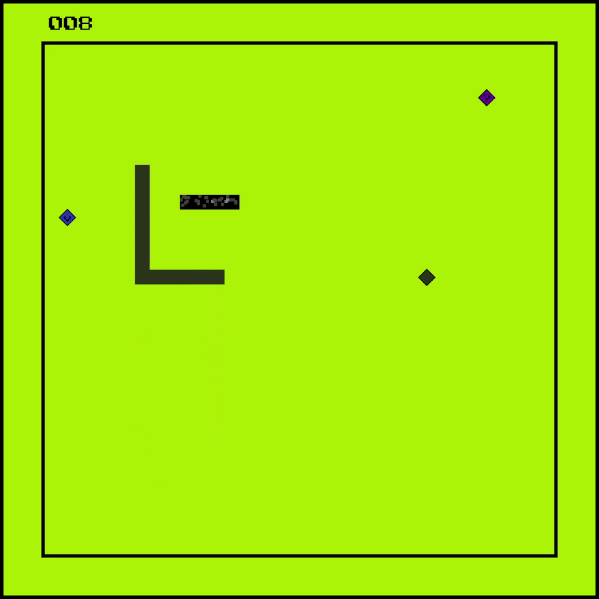
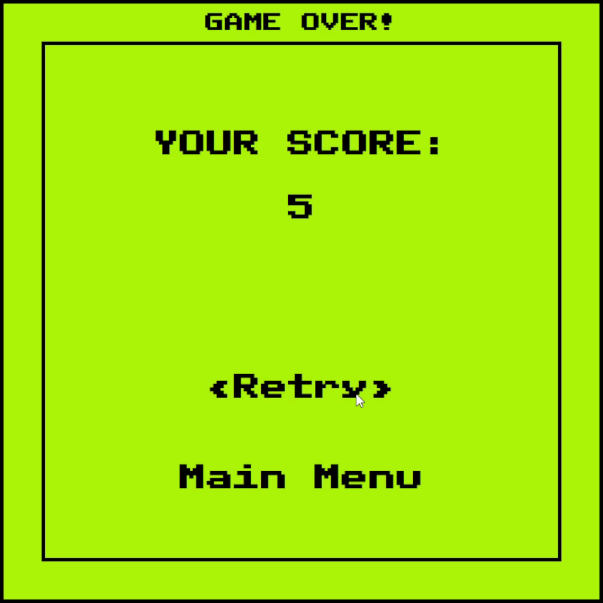
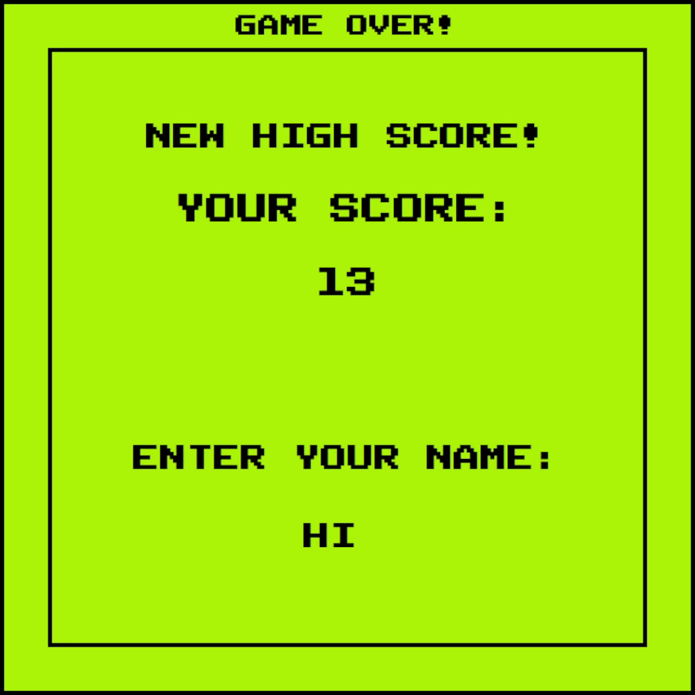
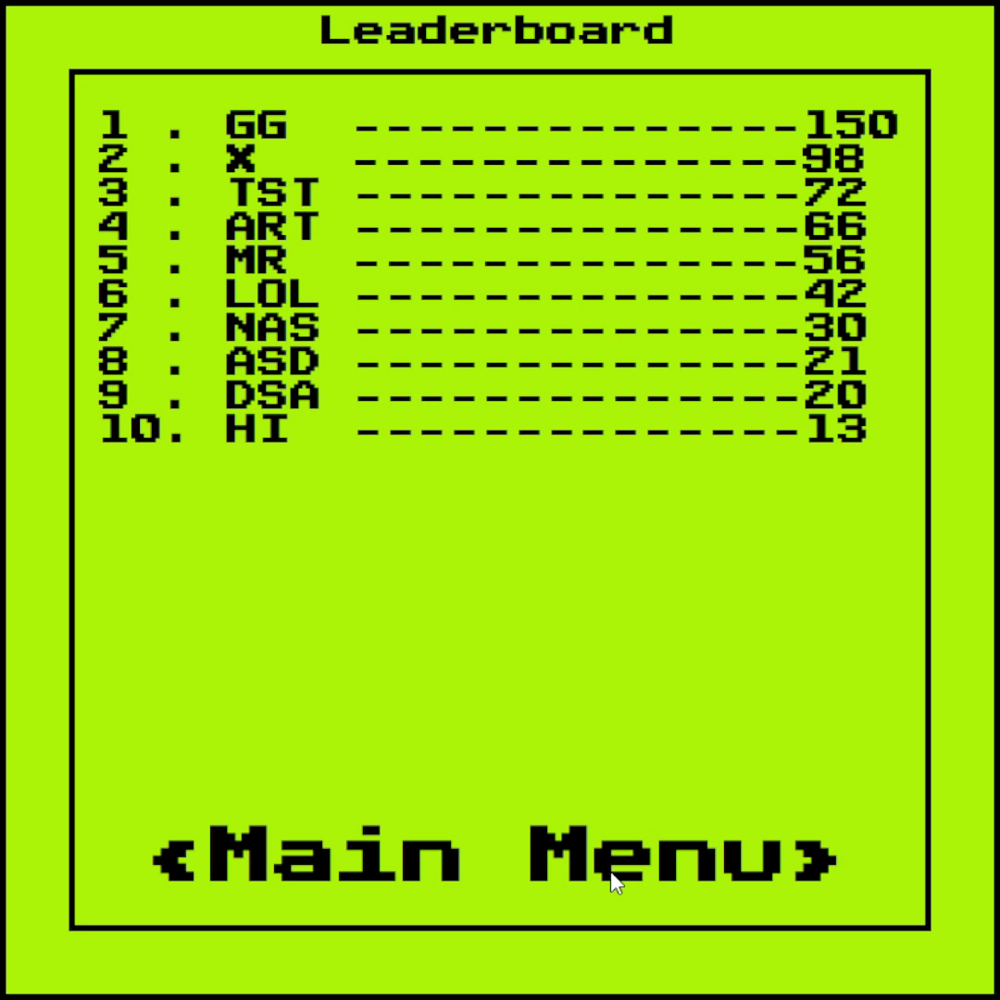

# Snake Evolution

## Introduction
Snake Evolution is a classic Snake game with a familiar design, 
but with a few re-vitalizing twists that "evolve" the well known classic.

## Installation
### Prerequisites
To play Snake Evolution, you need to have Java installed (JDK 17 minimum).
Additionally, if you want to build the game yourself, you will need Maven (https://maven.apache.org/download.cgi).

### Download Compiled Game
1. Navigate to [Releases](https://git.chalmers.se/orlovs/gr10-snake-evolution/-/releases) and Open the latest release.
2. Download the latest Release archive ([v1.0.zip](https://git.chalmers.se/orlovs/gr10-snake-evolution/-/blob/main/builds/v1.0.zip))
3. Unpack the archive
4. Launch the game from the terminal: `java -jar snake-evolution-1.0.jar`

### Build
Follow these instructions if you want to build the game locally:
1. Clone the repository or download source code.
2. From the project folder `gr10-snake-evolution`, run `mvn clean package`.
3. The compiled .jar will appear in the `target` directory, run it from there:
```
cd target
java -jar snake-evolution-1.0-jar-with-dependencies.jar
```
_Note: the directory that contains the game executable must also contain the assets folder to run!_

## How To Play
<table>
  <tr>
    <td>
      
    </td>
    <td>
      <h3>Main Menu</h3>
      <p>Navigate the menu using the mouse. The active button will be highlighted as seen on the screenshot.</p>
      <p>Click the buttons to trigger corresponding action:</p>
      <ul>
        <li>'Start' - Starts the game</li>
        <li>'Tutorial' - Displays the tutorial seen above in-game</li>
        <li>'Leaderboard' - Shows the current leaderboard</li>
        <li>'Exit' - Closes the game</li>
      </ul>
    </td>
  </tr>
  <tr>
    <td>
      
    </td>
    <td>
      <h3>Gameplay</h3>
      <p>The game screen contains the playing field, and displays the current score in the top-left corner.</p>
      <p style="font-style: italic"> See gameplay tutorial in the next section</p>
    </td>
  </tr>
  <tr>
    <td>
      
    </td>
    <td>
      <h3>Game Over</h3>
      <p>After losing, this screen will appear if a high score has not been reached.</p>
      <p>Click corresponding buttons to retry or return to main menu.</p>
    </td>
  </tr>
  <tr>
    <td>
      
    </td>
    <td>
      <h3>Game Over (high score)</h3>
      <p>After losing, this screen will appear if a high score has been reached.</p>
      <p>Enter your initials (up to 3 letters) and press [Enter] to be added to the Leaderboard.</p>
      <p>After that, the Leaderboard will be displayed.</p>
    </td>
  </tr>
  <tr>
    <td>
      
    </td>
    <td>
      <h3>Leaderboard</h3>
      <p>Leaderboard displays the last 10 best scores in descending order, with corresponding player names.</p>
      <p>Click the 'Main Menu' button to return to the menu.</p>
    </td>
  </tr>
</table>

### Gameplay Tutorial

